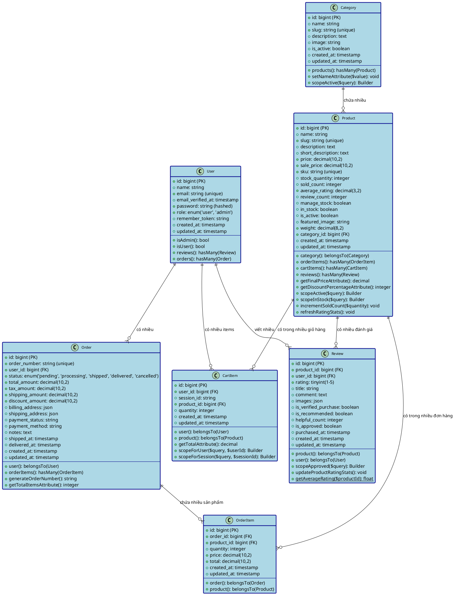

# Sơ đồ UML - Hệ thống E-commerce Laravel

## Sơ đồ Use Case (PlantUML)

```plantuml
@startuml E-commerce Use Case Diagram

top to bottom direction

skinparam usecase {
    BorderThickness 2
    FontSize 11
}

skinparam actor {
    BorderThickness 2
    FontSize 12
}

skinparam package {
    BorderThickness 1
    FontSize 13
}

skinparam rectangle {
    BorderThickness 2
    FontSize 14
}

skinparam packageStyle rectangle
skinparam linetype ortho

' === ACTORS ===
actor "User\n(Khách hàng)" as User #LightBlue
actor "Admin\n(Quản trị viên)" as Admin #LightGreen

User -[hidden]down- Admin

' === SYSTEM BOUNDARY ===
rectangle "Hệ thống E-commerce Laravel" #LightGray {

    ' === USER USE CASES ===
    package "Chức năng User" #LightCyan {
        ' Authentication
        usecase "Đăng nhập" as UC001
        usecase "Đăng ký" as UC002
        usecase "Đăng xuất" as UC003
        
        ' Product Browsing  
        usecase "Xem danh sách sản phẩm" as UC004
        usecase "Xem chi tiết sản phẩm" as UC005
        usecase "Tìm kiếm sản phẩm" as UC006
        usecase "Lọc sản phẩm theo danh mục" as UC007
        
        ' Cart Management
        usecase "Thêm vào giỏ hàng" as UC008
        usecase "Xem giỏ hàng" as UC009
        usecase "Cập nhật giỏ hàng" as UC010
        usecase "Xóa khỏi giỏ hàng" as UC011
        
        ' Order Management
        usecase "Thanh toán đơn hàng" as UC012
        usecase "Xem lịch sử đơn hàng" as UC013
        usecase "Xem chi tiết đơn hàng" as UC014
        usecase "Hủy đơn hàng" as UC015
        
        ' Review System
        usecase "Viết đánh giá" as UC016
        usecase "Xem đánh giá" as UC017
        usecase "Xóa đánh giá" as UC018
    }
    
    ' Force vertical layout with hidden links
    UC018 -[hidden]down- UC201
    
    ' === SYSTEM USE CASES ===
    package "Hệ thống tự động" #LightYellow {
        usecase "Tự động cập nhật rating" as UC201
        usecase "Tự động cập nhật payment status" as UC202
        usecase "Kiểm tra stock" as UC203
        usecase "Tạo order number" as UC204
    }
    
    ' Force vertical layout with hidden links
    UC204 -[hidden]down- UC101

    ' === ADMIN USE CASES ===
    package "Chức năng Admin" #LightSalmon {
        ' Dashboard
        usecase "Truy cập Dashboard" as UC101
        
        ' Category Management
        usecase "Quản lý danh mục" as UC102
        usecase "Thêm danh mục" as UC103
        usecase "Sửa danh mục" as UC104
        usecase "Xóa danh mục" as UC105
        
        ' Product Management
        usecase "Quản lý sản phẩm" as UC106
        usecase "Thêm sản phẩm" as UC107
        usecase "Sửa sản phẩm" as UC108
        usecase "Xóa sản phẩm" as UC109
        
        ' Order Management
        usecase "Xem tất cả đơn hàng" as UC110
        usecase "Cập nhật trạng thái đơn hàng" as UC111
        usecase "Xuất báo cáo" as UC112
        
        ' User Management
        usecase "Quản lý người dùng" as UC113
        usecase "Xem thông tin user" as UC114
        usecase "Xóa người dùng" as UC115
    }
}

' === USER RELATIONSHIPS ===
User --> UC001
User --> UC002
User --> UC003
User --> UC004
User --> UC005
User --> UC006
User --> UC007
User --> UC008
User --> UC009
User --> UC010
User --> UC011
User --> UC012
User --> UC013
User --> UC014
User --> UC015
User --> UC016
User --> UC017
User --> UC018

' === ADMIN RELATIONSHIPS ===
Admin --> UC101
Admin --> UC102
Admin --> UC103
Admin --> UC104
Admin --> UC105
Admin --> UC106
Admin --> UC107
Admin --> UC108
Admin --> UC109
Admin --> UC110
Admin --> UC111
Admin --> UC112
Admin --> UC113
Admin --> UC114
Admin --> UC115

' === INCLUDE RELATIONSHIPS ===
UC008 ..> UC203 : "<<include>>"
UC012 ..> UC204 : "<<include>>"
UC012 ..> UC203 : "<<include>>"
UC016 ..> UC201 : "<<include>>"
UC111 ..> UC202 : "<<include>>"

' === EXTEND RELATIONSHIPS ===
UC015 ..> UC013 : "<<extend>>"
UC018 ..> UC016 : "<<extend>>"

@enduml
```

## Sơ đồ Phân rã Chức năng (Function Breakdown Diagram)

```plantuml
@startuml Function Breakdown Diagram

top to bottom direction

skinparam rectangle {
    BorderThickness 2
    FontSize 12
    BackgroundColor LightGray
}

skinparam usecase {
    BorderThickness 1
    FontSize 11
    BackgroundColor LightBlue
}

' === ROOT NODE ===
rectangle "Hệ thống E-commerce Laravel" as Root

' === LEVEL 1 - MAIN MODULES ===
usecase "Module\nSản phẩm" as ProductModule
usecase "Module\nBán hàng" as SalesModule  
usecase "Module\nNgười dùng" as UserModule
usecase "Module\nHệ thống" as SystemModule

' === LEVEL 2 - PRODUCT FUNCTIONS ===
usecase "QL danh mục" as CategoryMgmt
usecase "QL sản phẩm" as ProductMgmt
usecase "Tìm kiếm" as SearchMgmt
usecase "Đánh giá" as ReviewMgmt

' === LEVEL 2 - SALES FUNCTIONS ===
usecase "QL giỏ hàng" as CartMgmt
usecase "QL đơn hàng" as OrderMgmt
usecase "Thanh toán" as PaymentMgmt

' === LEVEL 2 - USER FUNCTIONS ===
usecase "Xác thực" as AuthMgmt
usecase "Phân quyền" as AuthzMgmt
usecase "Profile" as ProfileMgmt

' === LEVEL 2 - SYSTEM FUNCTIONS ===
usecase "Dashboard" as DashboardMgmt
usecase "Báo cáo" as ReportMgmt
usecase "Tự động hóa" as AutoMgmt

' === CONNECTIONS ROOT TO LEVEL 1 ===
Root --> ProductModule
Root --> SalesModule
Root --> UserModule
Root --> SystemModule

' === CONNECTIONS LEVEL 1 TO LEVEL 2 ===
ProductModule --> CategoryMgmt
ProductModule --> ProductMgmt
ProductModule --> SearchMgmt
ProductModule --> ReviewMgmt

SalesModule --> CartMgmt
SalesModule --> OrderMgmt
SalesModule --> PaymentMgmt

UserModule --> AuthMgmt
UserModule --> AuthzMgmt
UserModule --> ProfileMgmt

SystemModule --> DashboardMgmt
SystemModule --> ReportMgmt
SystemModule --> AutoMgmt

@enduml

```



## Sơ đồ Class (PlantUML)



## Mô tả chi tiết Database Schema

### 1. Bảng Database

#### **users** 
- **Vai trò**: Quản lý người dùng với 2 loại role: 'user' và 'admin'
- **Key fields**: email (unique), role (enum), password (hashed)
- **Methods**: `isAdmin()`, `isUser()` để kiểm tra quyền
- **Relationships**: có nhiều orders, reviews, cart_items

#### **categories**
- **Vai trò**: Phân loại sản phẩm theo danh mục
- **Key fields**: name, slug (unique), is_active
- **Methods**: `setNameAttribute()` tự động tạo slug, `scopeActive()` 
- **Relationships**: có nhiều products

#### **products** 
- **Vai trò**: Lưu trữ thông tin sản phẩm chi tiết
- **Key fields**: sku (unique), price, sale_price, stock_quantity, average_rating
- **Business Logic**: Tự động tính final_price, discount_percentage
- **Methods**: `incrementSoldCount()`, `refreshRatingStats()`
- **Relationships**: thuộc về 1 category, có nhiều order_items, cart_items, reviews

#### **orders**
- **Vai trò**: Quản lý đơn hàng với lifecycle hoàn chỉnh
- **Key fields**: order_number (unique), status (enum), payment_status, payment_method
- **Business Logic**: Tự động generate order_number, update payment_status
- **JSON fields**: billing_address, shipping_address
- **Relationships**: thuộc về 1 user, có nhiều order_items

#### **order_items**
- **Vai trò**: Chi tiết sản phẩm trong từng đơn hàng
- **Key fields**: quantity, price, total
- **Business Logic**: Lưu giá tại thời điểm đặt hàng
- **Relationships**: thuộc về 1 order và 1 product

#### **cart_items**
- **Vai trò**: Giỏ hàng hỗ trợ cả user đăng nhập và guest
- **Key fields**: user_id (nullable), session_id, quantity
- **Business Logic**: Accessor `getTotalAttribute()` tính tổng tiền
- **Dual Support**: user_id cho user đăng nhập, session_id cho guest
- **Relationships**: thuộc về 1 user (nullable) và 1 product

#### **reviews**
- **Vai trò**: Đánh giá sản phẩm với verified purchase
- **Key fields**: rating (1-5), is_verified_purchase, is_approved
- **Business Logic**: Chỉ user đã mua hàng mới được review
- **Auto-update**: Tự động cập nhật product rating stats
- **JSON fields**: images (multiple review images)
- **Relationships**: thuộc về 1 product và 1 user

### 2. Database Relationships

#### **One-to-Many Relationships**:
- `users` → `orders`: User có nhiều đơn hàng
- `users` → `reviews`: User có nhiều đánh giá
- `users` → `cart_items`: User có nhiều items trong giỏ
- `categories` → `products`: Category chứa nhiều sản phẩm
- `products` → `order_items`: Product có trong nhiều đơn hàng
- `products` → `cart_items`: Product có trong nhiều giỏ hàng
- `products` → `reviews`: Product có nhiều đánh giá
- `orders` → `order_items`: Order chứa nhiều sản phẩm

#### **Foreign Key Constraints**:
- `products.category_id` → `categories.id`
- `orders.user_id` → `users.id`
- `order_items.order_id` → `orders.id`
- `order_items.product_id` → `products.id`
- `cart_items.user_id` → `users.id` (nullable)
- `cart_items.product_id` → `products.id`
- `reviews.product_id` → `products.id`
- `reviews.user_id` → `users.id`

### 3. Business Logic trong Models

#### **Tự động hóa (Automation)**:
1. **Product Rating**: Tự động cập nhật `average_rating` khi có review mới
2. **Order Number**: Tự động generate unique order number
3. **Payment Status**: Tự động update theo order status và payment method
4. **Stock Management**: Tự động trừ kho khi tạo order
5. **Slug Generation**: Tự động tạo slug từ name

#### **Validation & Security**:
1. **Verified Purchase**: Chỉ user đã mua mới được review
2. **Stock Check**: Kiểm tra stock trước khi add to cart
3. **Role-based Access**: Admin/User có quyền khác nhau
4. **Price Consistency**: Lưu giá tại thời điểm đặt hàng

#### **Performance Optimization**:
1. **Indexing**: Primary keys, foreign keys, unique constraints
2. **Eager Loading**: Load relationships khi cần
3. **Scopes**: Query optimization với conditional clauses
4. **Accessors**: Calculate derived fields on-demand

### 4. Đặc điểm kỹ thuật

- **Framework**: Laravel Eloquent ORM
- **Database**: MySQL với proper indexing
- **JSON Fields**: Flexible data storage cho addresses, images
- **Enum Fields**: Controlled values cho status, role, rating
- **Timestamps**: created_at, updated_at tự động
- **Soft Deletes**: Có thể implement cho data retention
- **Migration**: Version-controlled database schema

Đây là cấu trúc database schema hoàn chỉnh cho hệ thống E-commerce Laravel với đầy đủ business logic và relationships.

## Mô tả chi tiết Use Cases

### 1. Actors (Tác nhân)

#### **User (Khách hàng)**
- Người dùng đã đăng nhập vào hệ thống
- Có thể mua hàng, quản lý giỏ hàng, đánh giá sản phẩm
- Xem lịch sử đơn hàng và quản lý tài khoản

#### **Admin (Quản trị viên)**  
- Quản lý toàn bộ hệ thống
- CRUD operations cho sản phẩm, danh mục, đơn hàng
- Không được mua hàng (business rule)

### 2. Use Cases theo Actor

#### **A. Chức năng User**

**Authentication:**
- **UC001 - Đăng nhập**: Xác thực với email/password
- **UC002 - Đăng ký**: Tạo tài khoản mới (role = 'user')  
- **UC003 - Đăng xuất**: Kết thúc session

**Product Browsing:**
- **UC004 - Xem danh sách sản phẩm**: Hiển thị với pagination
- **UC005 - Xem chi tiết sản phẩm**: Thông tin đầy đủ + reviews
- **UC006 - Tìm kiếm sản phẩm**: Search theo tên, mô tả
- **UC007 - Lọc theo danh mục**: Filter products by category

**Cart Management:**
- **UC008 - Thêm vào giỏ hàng**: Include stock check
- **UC009 - Xem giỏ hàng**: Hiển thị items với tổng tiền
- **UC010 - Cập nhật giỏ hàng**: Thay đổi quantity
- **UC011 - Xóa khỏi giỏ hàng**: Remove items

**Order Management:**
- **UC012 - Thanh toán đơn hàng**: Checkout process với auto order number
- **UC013 - Xem lịch sử đơn hàng**: Danh sách orders của user
- **UC014 - Xem chi tiết đơn hàng**: Thông tin order + items
- **UC015 - Hủy đơn hàng**: Chỉ cho pending orders (extend UC013)

**Review System:**
- **UC016 - Viết đánh giá**: Chỉ cho verified purchase, auto update rating
- **UC017 - Xem đánh giá**: Hiển thị reviews của sản phẩm
- **UC018 - Xóa đánh giá**: User xóa review của mình (extend UC016)

#### **B. Chức năng Admin**

**Dashboard:**
- **UC101 - Truy cập Dashboard**: Admin homepage với statistics

**Category Management:**
- **UC102 - Quản lý danh mục**: Danh sách categories
- **UC103 - Thêm danh mục**: Create new category
- **UC104 - Sửa danh mục**: Update category info
- **UC105 - Xóa danh mục**: Delete category

**Product Management:**
- **UC106 - Quản lý sản phẩm**: Danh sách products
- **UC107 - Thêm sản phẩm**: Create với image upload
- **UC108 - Sửa sản phẩm**: Update product info
- **UC109 - Xóa sản phẩm**: Delete product

**Order Management:**
- **UC110 - Xem tất cả đơn hàng**: Admin view all orders
- **UC111 - Cập nhật trạng thái**: Change order status, auto update payment
- **UC112 - Xuất báo cáo**: Export order reports

**User Management:**
- **UC113 - Quản lý người dùng**: Danh sách users
- **UC114 - Xem thông tin user**: View user details
- **UC115 - Xóa người dùng**: Delete user account

#### **C. Hệ thống tự động**

- **UC201 - Tự động cập nhật rating**: Khi có review mới
- **UC202 - Tự động cập nhật payment status**: Theo order status
- **UC203 - Kiểm tra stock**: Trước khi add to cart/checkout
- **UC204 - Tạo order number**: Auto generate unique number

### 3. Business Rules

#### **Phân quyền:**
- Admin KHÔNG được mua hàng hoặc đánh giá
- User KHÔNG được truy cập admin functions

#### **Review Rules:**
- Chỉ user đã mua (verified purchase) mới được review
- 1 user chỉ review 1 lần cho 1 sản phẩm

#### **Order Rules:**
- Chỉ pending orders mới được hủy
- Payment status tự động update theo order status

#### **Stock Management:**
- Check stock khi add to cart và checkout
- Tự động trừ stock khi order thành công

### 4. System Automation

- **Include relationships**: Các chức năng tự động được gọi
- **Extend relationships**: Các chức năng mở rộng (optional)
- **Auto-triggers**: Rating update, payment status, stock management

Sơ đồ này đã được đơn giản hóa, tập trung vào 2 actors chính và loại bỏ các chức năng thừa.

## Mô tả chi tiết Sơ đồ Phân rã Chức năng

### Cấu trúc Phân rã 3 Cấp

#### **LEVEL 1: 4 Module Chính**

**🌐 Module Quản lý Sản phẩm (Product Module)**
- Chịu trách nhiệm tất cả các chức năng liên quan đến sản phẩm
- Bao gồm danh mục, sản phẩm, tìm kiếm và đánh giá
- Controller chính: `ProductController`, `CategoryController`, `ReviewController`

**🛒 Module Quản lý Bán hàng (Sales Module)**
- Xử lý toàn bộ quy trình bán hàng từ giỏ hàng đến thanh toán
- Quản lý đơn hàng và báo cáo doanh thu
- Controller chính: `CartController`, `OrderController`

**👥 Module Quản lý Người dùng (User Module)**
- Quản lý xác thực, phân quyền và hoạt động người dùng
- Hệ thống role-based access control
- Controller chính: `AuthController`, `UserController`

**⚙️ Module Hệ thống (System Module)**
- Các chức năng hệ thống, cấu hình và tự động hóa
- Dashboard và báo cáo tổng quan
- Controller chính: `AdminController`, `DashboardController`

#### **LEVEL 2: Nhóm Chức năng Chi tiết (16 nhóm)**

**📦 Quản lý Danh mục**
- CRUD operations cho categories
- Validation và slug generation
- Active/inactive status management

**🏷️ Quản lý Sản phẩm**
- CRUD operations cho products
- Image management với upload/delete
- SKU generation và stock management

**🔍 Tìm kiếm & Lọc**
- Multi-criteria search (name, category, price, rating)
- Advanced filtering với query optimization
- Sorting và pagination

**⭐ Hệ thống Đánh giá**
- Verified purchase reviews
- Rating calculation và statistics
- Review approval workflow

**🛍️ Quản lý Giỏ hàng**
- Session-based cart cho guest users
- Database-based cart cho logged users
- Stock validation khi thêm/cập nhật

**💳 Xử lý Đơn hàng**
- Order lifecycle management
- Status tracking (pending → delivered)
- Order cancellation với business rules

**💰 Thanh toán**
- Multiple payment methods (COD, Bank Transfer)
- Payment status automation
- Refund processing logic

**🔐 Xác thực**
- Login/logout với session management
- Password hashing và validation
- Remember token functionality

**🔒 Phân quyền**
- Role-based access control (Admin/User)
- Middleware protection
- Route access restrictions

#### **LEVEL 3: Chức năng Atomic (50+ functions)**

**Ví dụ phân rã chi tiết cho "Thêm Sản phẩm":**
1. **📝 Validate Dữ liệu**: Form validation với Laravel Request
2. **🏷️ Tạo SKU**: Unique SKU generation
3. **🖼️ Upload Hình ảnh**: File upload với validation
4. **💾 Lưu Database**: Transaction-safe database save

**Ví dụ phân rã chi tiết cho "Tạo Đơn hàng":**
1. **✅ Validate Cart**: Kiểm tra cart không rỗng
2. **📦 Check Stock**: Verify stock availability
3. **🔢 Generate Order Number**: Unique order number creation
4. **💾 Save Order**: Create order record
5. **📦 Update Stock**: Decrement product stock
6. **🗑️ Clear Cart**: Remove cart items

### Mapping với Code Structure

#### **Controllers Mapping:**
- **ProductController**: Handles Level 2 functions của Product Module
- **CartController**: Implements Cart Management functions
- **OrderController**: Manages Order Processing workflow
- **ReviewController**: Handles Review System functions
- **AuthController**: Implements Authentication functions

#### **Models Mapping:**
- **Product Model**: Encapsulates product-related Level 3 functions
- **Order Model**: Contains order processing automation
- **Review Model**: Implements rating calculation automation
- **User Model**: Handles authentication và authorization

#### **Middleware Mapping:**
- **IsAdmin**: Implements admin authorization check
- **PreventAdminAccess**: Enforces role-based restrictions

#### **Business Logic Mapping:**
- **Auto Rating Update**: Triggered trong Review Model boot()
- **Auto Payment Status**: Implemented trong Order Model boot()
- **Stock Management**: Distributed across Cart và Order controllers

### Key Design Principles

1. **Single Responsibility**: Mỗi function chỉ làm 1 việc cụ thể
2. **Modularity**: Functions được nhóm theo business domains
3. **Reusability**: Common functions có thể được reuse
4. **Separation of Concerns**: UI, Business Logic, Data Access tách biệt
5. **Automation**: System functions chạy tự động khi cần

### Performance Considerations

- **Database Optimization**: Eager loading, indexing
- **Caching Strategy**: Session-based cart, query caching  
- **Transaction Management**: Atomic operations cho critical functions
- **Validation Strategy**: Client-side + Server-side validation

Sơ đồ này thể hiện cách hệ thống được tổ chức thành các module độc lập, mỗi module có các nhóm chức năng rõ ràng, và mỗi chức năng được phân rã thành các atomic operations có thể test và maintain dễ dàng.
